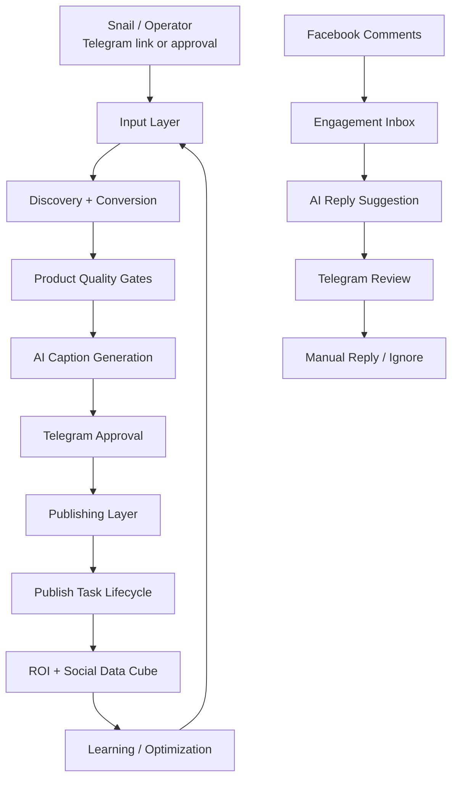
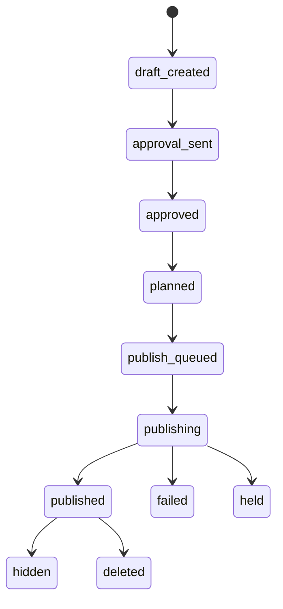

# AffiliPilot — Operating Model

> Revenue-first affiliate operating system: **Source → Draft → Approve → Publish → Track → Learn → Improve**

## 1. High-level flow



## 2. Pipeline by layer

| Layer | Responsibility | Current status |
|---|---|---|
| Input | Manual Shopee/Lazada/Tiki/Accesstrade links + scheduled source hunter | Active |
| Discovery | Resolve shortlinks, parse product page, extract media/title/video | Active |
| Conversion | Create affiliate link and preserve tracking identity | Active |
| Product Quality | Filter bad products, page-audience mismatch, missing media/link | Active |
| AI Caption | Generate one concise AI benefit sentence | Active |
| System Renderer | Append fixed price/provider CTA and hashtags | Active |
| Approval | Telegram approval card before production publish | Active |
| Publish Strategy | Select Facebook publish type: `photo_post`, `video_post`, `reel`, `link_post`, `text_post` | Active |
| Publishing | Facebook dry-run plan and gated publish by publish type | Active |
| Lifecycle | Track states plus `publish_type` and `metrics_profile` in `publish_events` and `publish_tasks` | Active |
| ROI | Accesstrade order/commission digest by `post_id/utm_content` | MVP active |
| Social Data Cube | Store impressions/reach/clicks/comments/shares | Foundation active |
| Engagement | Fetch/store comments and queue reply review cards | Foundation active |
| Learning | Use ROI/social data to improve sourcing | Next phase |

## 3. Detailed operating flow

```text
Product link / cron source
        |
        v
Resolve shortlink
        |
        v
Discover product facts + media
        |
        v
Convert affiliate link + tracking identity
        |
        v
Product quality / offer / media gates
        |
        +--> FAIL: hold/block + digest
        |
        v
Publish strategy selector
        |
        +--> photo_post: 1-10 product images
        +--> video_post: product video ready
        +--> reel: short/vertical video candidate
        +--> link_post: fallback when no good media
        |
        v
AI caption generation by publish type
        |
        v
Caption quality gate
        |
        +--> FAIL: AI retry with feedback
        |          |
        |          +--> still fail: hold/block, no deterministic long fallback
        |
        v
Render final caption
        |
        v
Telegram approval card
        |
        +--> pending / reject / hold
        |
        v
Facebook dry-run plan
        |
        v
Explicit approval publish
        |
        v
Publish lifecycle tracking
        |
        v
ROI + social metrics sync
        |
        v
Learning loop for better sourcing
```

## 4. Caption policy

Final caption format:

```text
<1 short AI-generated benefit sentence>

Giá tham khảo trên <Provider> <Giá sản phẩm>, link affiliate 👇
#chobevui #dodungchobe #muasamthongminh
```

Rules:

- Caption content must be AI-generated by default.
- AI must not write price/provider/link line.
- System appends the fixed CTA.
- No warning/checklist phrases such as:
  - “Trước khi mua nên xem kỹ...”
  - “luôn để người lớn...”
  - “người lớn quan sát”
  - long caution/checklist paragraphs
- If AI fails bounded retries, hold/block. Do not fallback to deterministic long repair copy.

## 5. Publish lifecycle state machine



States currently supported:

```text
draft_created
approval_sent
approved
planned
publish_queued
publishing
published
hidden
deleted
failed
held
```

Stored in:

- `publish_events` — append-only event log
- `publish_tasks` — latest normalized state per post/platform

## 6. Tracking / ROI model

```text
tracking_post_id == final post_id == utm_content
```

This identity is preserved through:

```text
Accesstrade conversion
    -> manual input / converted product JSON
    -> daily batch draft
    -> publish event
    -> ROI digest
```

ROI digest reads:

- `publish_events`
- `accesstrade_orders`
- `utm_content/post_id`

Current ROI CLI:

```bash
python3 -m affilipilot roi-digest
python3 -m affilipilot roi-digest --sync --dry-run
python3 -m affilipilot roi-digest --queue
```

## 7. Platform restrictions registry

Current platform: `facebook_page`, split by publish type:

| Key | Publish type | Metrics profile | Use case |
|---|---|---|---|
| `facebook_page.photo_post` | `photo_post` | `feed_post` | 1–10 product images |
| `facebook_page.video_post` | `video_post` | `feed_video` | Product video is ready |
| `facebook_page.reel` | `reel` | `reel` | Short/vertical video candidate |
| `facebook_page.link_post` | `link_post` | `feed_post` | Fallback when no good media exists |
| `facebook_page.text_post` | `text_post` | `feed_post` | Last-resort fallback; generally hold affiliate posts |

Common rules:

- Production publish requires delivered Telegram approval.
- Minimal caption policy required.
- If product video is available but not publish-ready, hold instead of silently publishing image-only.
- Data cube must keep `publish_type` and `metrics_profile` so Reel metrics are not mixed with normal feed posts.

CLI:

```bash
python3 -m affilipilot platform-restrictions
```

## 8. Social data cube

Stores post-level social metrics:

```text
platform
post_id
provider_post_id
publish_type
metrics_profile
impressions
reach
clicks
reactions
comments
shares
raw_json
captured_at
```

CLI:

```bash
python3 -m affilipilot social-metrics
python3 -m affilipilot social-metric-record --post-id <post_id> --impressions 10
python3 -m affilipilot facebook-insights-sync --post-id <post_id> --provider-post-id <fb_post_id>
```

Current status: foundation active; not yet wired into scheduled digest by default.

## 9. Engagement / comment workflow

```text
Facebook comments
    -> fetch/store in engagement_comments
    -> AI reply suggestion
    -> Telegram review card
    -> operator chooses /aff_reply or /aff_ignore
```

Important guardrail:

- No auto-reply.
- Comment replies are approval-first.

CLI:

```bash
python3 -m affilipilot comment-record --post-id <post_id> --comment-id <comment_id> --message "..."
python3 -m affilipilot comments --post-id <post_id>
python3 -m affilipilot queue-comment-reviews --post-id <post_id>
```

Current status: foundation active; real `/aff_reply` and `/aff_ignore` handlers are not implemented yet.

## 10. Cron behavior

```text
Cron slot
    -> scheduled_e2e_queue.sh
    -> auto-source-hunter
    -> approval card if post ready
    -> status digest if no post ready
    -> openclaw-telegram-send
```

Rule:

> Cron runs must always notify Telegram, even when no publish-ready post exists.

## 11. Key operational commands

```bash
# Health
python3 -m affilipilot doctor

# Platform rules
python3 -m affilipilot platform-restrictions

# Publish lifecycle
python3 -m affilipilot publish-status --batch-key <batch>
python3 -m affilipilot publish-tasks --batch-key <batch>

# ROI
python3 -m affilipilot roi-digest
python3 -m affilipilot roi-digest --sync --dry-run
python3 -m affilipilot roi-digest --queue

# Social metrics
python3 -m affilipilot social-metrics
python3 -m affilipilot social-metric-record --post-id <post_id> --impressions 10
python3 -m affilipilot facebook-insights-sync --post-id <post_id> --provider-post-id <fb_post_id>

# Engagement
python3 -m affilipilot comment-record --post-id <post_id> --comment-id <comment_id> --message "..."
python3 -m affilipilot comments --post-id <post_id>
python3 -m affilipilot queue-comment-reviews --post-id <post_id>
```

## 12. Current status

Done:

- Shopee shortlink support
- AI concise minimal caption
- Fixed price/provider CTA
- Warning/checklist phrase removal
- Always-notify cron
- Tracking identity preservation
- ROI digest MVP
- Publish task lifecycle with publish type / metrics profile
- Platform restrictions registry by Facebook publish type
- Publish strategy selector for photo/video/reel/link/text
- Social data cube foundation with publish type / metrics profile
- Comment reply review foundation

Not done yet:

- Wire Facebook insights sync into scheduled digest
- Implement real `/aff_reply` and `/aff_ignore` Telegram handlers
- Add click-level analytics if provider/API supports it
- Add stable dev bootstrap/CI for pytest

## 13. Safety principles

```text
No publish without Telegram approval.
No auto-reply comment.
No deterministic long fallback caption.
No image-only publish when product video should be used but is not ready.
Cron must always notify.
Tracking identity must survive conversion -> publish -> ROI.
```


## 14. Video probing for publish strategy

AffiliPilot uses `ffprobe` when available to inspect local product videos before selecting Facebook publish type.

Rules:

```text
vertical video + duration <= 90s -> facebook_page.reel / metrics_profile=reel
other valid local video          -> facebook_page.video_post / metrics_profile=feed_video
explicit metadata hint           -> can still mark as reel when probing is unavailable
```

Probe fields captured in strategy payload when available:

```text
video_width
video_height
video_duration_seconds
```

This is still a planning/strategy foundation. Production Reel upload remains a separate implementation step.
